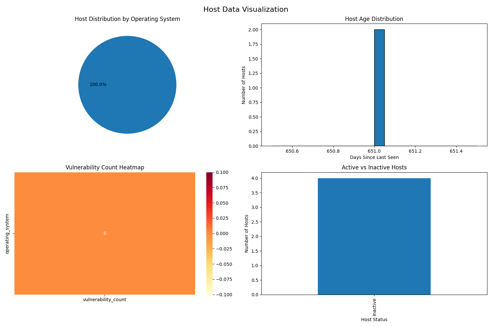

# Data Pipeline for Qualys and Crowdstrike Hosts

### Setup Instructions
1. Clone this repository.
   ```bash
    git clone https://github.com/prashant3286/silk-data-pipeline
    cd silk-data-pipeline
   ```
2. Install dependencies:
   ```bash
   poetry install
   ```
3. Configure your settings in:
    ```bash
    src/config/settings.py
   ```
   Please add the .env configuaration values

4. Run the pipeline:
    ```bash
   poetry run python -m src.main
   ```

5. Run the visualization:
    ```bash
    python3 visualize_data.py
   ```
    
- Host distribution by OS.
- Old vs new hosts.

6. You can also see the recording how to run the project:
    [Loom video](https://www.loom.com/share/9c97c59ae9e8429fa63c754113bde580?sid=219d370a-94f7-475c-9458-9d4fa12b5563)
## Screenshot:




## To scale a system to support millions of objects, there are several key strategies and principles you should follow. Here is an answer along with an explanation:

- Database Optimization:

    Sharding distributes data across multiple databases, enabling horizontal scaling and balancing the load. This is critical for handling large datasets.
    Indexing improves query performance by allowing the database to quickly locate rows within large tables.
    NoSQL Databases are designed to handle large volumes of unstructured data and offer high availability, partition tolerance, and horizontal scaling.
    Caching reduces the load on the database by temporarily storing frequently accessed data in memory, leading to faster query responses.

- Load Balancing:

    Distributes incoming traffic across multiple servers to prevent any single server from becoming a bottleneck.
    Load balancers also provide failover capabilities, ensuring high availability and reliability.

- Microservices Architecture:

    Decomposes monolithic applications into smaller, manageable services that can be developed, deployed, and scaled independently.
    This approach improves fault isolation, development speed, and scalability.

- Horizontal Scaling:

    Involves adding more servers to handle increased load, providing better scalability than vertical scaling (adding more power to a single server).
    Stateless applications can easily scale horizontally because they do not rely on server-specific data.

- Distributed File Systems:

    Store data across multiple nodes, ensuring data redundancy and high availability.
    Suitable for handling large datasets and providing scalable storage solutions.

- Asynchronous Processing:

    Offloads time-consuming tasks to background jobs or message queues, improving the responsiveness of the main application.
    This is essential for handling tasks that can be processed independently and do not require immediate user feedback.

- Monitoring and Logging:

    Provides visibility into system performance and helps identify bottlenecks and issues.
    Monitoring tools can alert you to potential problems before they impact users.

- Auto-scaling:

    Automatically adjusts the number of running instances based on traffic, ensuring optimal resource utilization and cost management.
    Helps maintain performance during traffic spikes and reduces costs during low-traffic periods.
